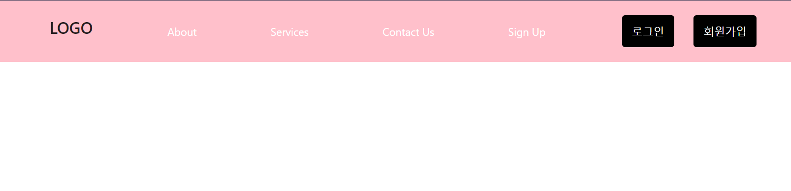
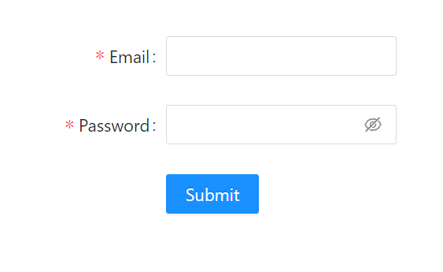
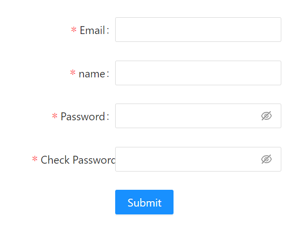

# MERN Project

## 🌟 프로젝트 소개(Boiler Plate)

### React를 활용한 로그인, 로그아웃, 회원가입 기능 구현

### 배포: [https://fathomless-savannah-85923.herokuapp.com/](https://fathomless-savannah-85923.herokuapp.com/)

### <기술 스택>

|  포지션  |                     스킬                     | 사용 |
| :------: | :------------------------------------------: | :--: |
| FrontEnd | React, Redux, antd, styled-components, axios |  O   |
| BackEnd  |           Node.js, Express, bcrypt           |  O   |
|    DB    |              MongoDB, mongoose               |  O   |
|  Deploy  |              Heroku, Heroku CLI              |  O   |

# <프론트엔드 기능>

## 1. 상태 관리, Redux, Redux-Middleware

- redux로상태관리
- redux-thunk, redux-Promise Middelware를 사용함으로써 function, Promise형태의 action도 받아올 수 있게 한다.

```javascript
import { Provider } from "react-redux";
import { applyMiddleware, createStore } from "redux";
import promiseMiddleware from "redux-promise";
import ReduxThunk from "redux-thunk";

const createStoreWithMiddleware = applyMiddleware(
  promiseMiddleware,
  ReduxThunk
)(createStore);

ReactDOM.render(
  <Provider
    store={createStoreWithMiddleware(
      Reducer,
      window.__REDUX_DEVTOOLS_EXTENSION__ &&
        window.__REDUX_DEVTOOLS_EXTENSION__()
    )}
  >
    <App />
  </Provider>,
  document.getElementById("root")
);
```

<!-- store는 객체(plain object)형태의 action으로 받는데
store는 항상 객체 형태의 action만 받는건 아니다.
어쩔때는 Promise 또는 function형태로 받는 경우도 있다.
redux-thunk - 어떡해 function을 받을지 알려주는 것
redux-promise - 어떡해 Promise형태로 받는지 알려주는 것 -->

## 2. Axios , 서버로 데이터 요청

action통해서 axios로 서버에 요청 시 Error(\*아래 확인)

```javascript
import axios from "axios";
import { LOGIN_USER, REGISTER_USER, AUTH_USER } from "./types";

export async function loginUser(dataToSubmit) {
  const request = await axios
    .post("/api/users/login", dataToSubmit)
    .then((response) => response.data);

  return {
    type: LOGIN_USER,
    payload: request,
  };
}
```

## 3. HTTPS , Proxy 설정 (위의 문제 해결)

client의 port는 3000이고 server의 port는 5000이라서 proxy 설정

```javascript
const { createProxyMiddleware } = require("http-proxy-middleware");

module.exports = function (app) {
  app.use(
    "/api",
    createProxyMiddleware({
      target: "http://localhost:5000", // client에서 타켓을 줄때 5000번으로 주겠다는 말
      changeOrigin: true,
    })
  );
};
```

## 4. 프론트엔드 디자인 (Ant Design, Styled-Components)

### <Styled-Components - NavBar 디자인>

요소들을 가지고 와서 사용

- NavBar
  

Elements를 design 한 후

```javascript
import { FaBars } from "react-icons/fa";
import { Link } from "react-router-dom";
import styled from "styled-components";

export const Nav = styled.nav`
  background-color: pink;
  height: 80px;
  display: flex;
  justify-content: space-between;
  padding: 0.5rem calc((100vw - 1000px) / 2);
  z-index: 10;
  /* Third Nav */
  /* justify-content: flex-start; */
```

```javascript
import {
  Nav,
  NavLink,
  Bars,
  NavMenu,
  NavBtn,
  NavBtnLink,
} from "./NavbarElements";

<Nav>
  <NavLink to="/">
    <h1>LOGO</h1>
  </NavLink>
  <Bars />
  <NavMenu>
    <NavLink to="/" activestyle="true">
      About
    </NavLink>
    <NavLink to="/" activestyle="true">
      Services
    </NavLink>
    <NavLink to="/" activestyle="true">
      Contact Us
    </NavLink>
    <NavLink to="/" activestyle="true">
      Sign Up
    </NavLink>
    {/* Second Nav */}
    {/* <NavBtnLink to='/sign-in'>Sign In</NavBtnLink> */}
  </NavMenu>

  <>
    {!firstRender ? (
      <>
        <NavBtn style={{ margin: "0 0 0 50px" }}>
          <NavBtnLink to="/login">로그인</NavBtnLink>
        </NavBtn>

        <NavBtn>
          <NavBtnLink to="/register">회원가입</NavBtnLink>
        </NavBtn>
      </>
    ) : (
      <>
        <NavBtn>
          <NavBtnLink onClick={onClickHandler}>로그아웃</NavBtnLink>
        </NavBtn>
      </>
    )}
  </>
</Nav>;
```

### <Ant Design - 로그인, 회원가입 Form 스타일 추가>

- 로그인
  
- 회원가입
  

```javascript
import { Form, Input, Button } from "antd";

const layout = {
  labelCol: {
    span: 8,
  },
  wrapperCol: {
    span: 16,
  },
};
const tailLayout = {
  wrapperCol: {
    offset: 8,
    span: 16,
  },
};

<Form
  {...layout}
  name="basic"
  initialValues={{
    remember: true,
  }}
>
  <Form.Item
    label="Email"
    name="Email"
    rules={[
      {
        required: true,
        message: "Please input your Email!",
      },
    ]}
  >
    <Input type="email" value={Email} onChange={onEmailHandler} />
  </Form.Item>

  <Form.Item
    label="Password"
    name="password"
    rules={[
      {
        required: true,
        message: "Please input your password!",
      },
    ]}
  >
    <Input.Password
      type="password"
      value={Password}
      onChange={onPasswordHandler}
    />
  </Form.Item>

  <Form.Item {...tailLayout}>
    <Button type="primary" htmlType="submit" onClick={onSubmitHandler}>
      Submit
    </Button>
  </Form.Item>
</Form>;
```

# <백엔드 기능>

## 1. 비밀번호 암호화, bcrypt

```javascript
  // 비밀 번호를 바꿀때만 암호화를 해야하니까 isModified로 체크하고 맞으면 암호화
  if (user.isModified("password")) {
    bcrypt.genSalt(saltRounds, function (err, salt) {
      if (err) return next(err);

      bcrypt.hash(user.password, salt, function (err, hash) {
        // 여기서 hash는 암호화된 비밀번호
        if (err) return next(err);
        user.password = hash;
        next();
      });
```

---

## 2. client, server 동시 실행, concurrently

```javascript
 "dev": "concurrently \"npm run backend\" \"npm run start --prefix client\""
```

---

## 3. MongoDB연결, Shema, mongoose

model User안에 Schema를 만들어준다.

```javascript
const mongoose = require("mongoose");
const bcrypt = require("bcrypt");
const saltRounds = 10;
const jwt = require("jsonwebtoken");

const userSchema = mongoose.Schema({
  name: {
    type: String,
    maxlength: 50,
  },
  email: {
    type: String,
    trim: true, // trim은 아래 이메일에 빈 공백을 없애주는 역할
    // crosi 1157@naver.com
    unique: 1, // 유니크하게 똑같은 이메일은 못쓰게
  },
  password: {
    type: String,
    minlength: 5,
  },
  lastname: {
    type: String,
    maxlength: 50,
  },
  role: {
    // 관리자, 일반유저 판단 넘버가 1이면 관리자, 0이면 일반유저
    type: Number,
    default: 0, // 만약에 role을 주지않으면 default값으로 0을 주겠다.
  },
  image: String,
  token: {
    type: String,
  },
  tokenExp: {
    // 토큰 유효기간
    type: Number,
  },
});
```

mongoose패키지를 이용해서 DB와 연결

```javascript
mongoose
  .connect(config.mongoURI, {
    // 아래 코드 있어야 오류 안남
    useNewUrlParser: true,
    useUnifiedTopology: true,
    useCreateIndex: true,
    useFindAndModify: false,
  })
  .then(() => console.log("MongoDB Connected....")) // 잘 연결됬는지 확인
  .catch((err) => console.log(err));
```

---

## 4. Auth기능 토큰 & 쿠키, jsonwebtoken, cookie-parser

유저 고유 아이디(user_id)를 가지고 토큰생성하는 함수이고 그렇게 만든 토큰은 DB에 저장하고 callback으로 user데이터를 넘겨준다.

```javascript
const jwt = require("jsonwebtoken");

userSchema.methods.generateToken = function (cb) {
  // jsonwebtoken을 이용해서 token을 생성하기
  var user = this;

  // 여기서 user._id는 데이터베이스의 _id이다.
  var token = jwt.sign(user._id.toHexString(), "secretToken");

  user.token = token;
  user.save(function (err, user) {
    if (err) return cb(err);
    cb(null, user);
  });
};
```

그렇게 넘겨 받은 토큰을 쿠키에 저장.

```javascript
const cookieParser = require("cookie-parser");

app.use(cookieParser());

// 비밀번호까지 맞다면 토큰을 생성하기.
user.generateToken((err, user) => {
  if (err) return res.status(400).send(err);

  // 토큰을 저장한다. 어디에 ? 쿠키, localStorage 등등 저장할 곳은 많다. 여기서는 쿠키
  res
    .cookie("x_auth", user.token)
    .status(200)
    .json({ loginSuccess: true, userId: user._id });
});
```

---

## 5. body-parser

```javascript
const bodyParser = require("body-parser");

// application/x-www-form-urlencoded 이렇게 생긴 데이터를 분석해서 가져올 수 있게 해준다.
app.use(bodyParser.urlencoded({ extended: true }));

// application/json JSON형태로 된 데이터를 가져올 수 있게 해주고
app.use(bodyParser.json());
```
